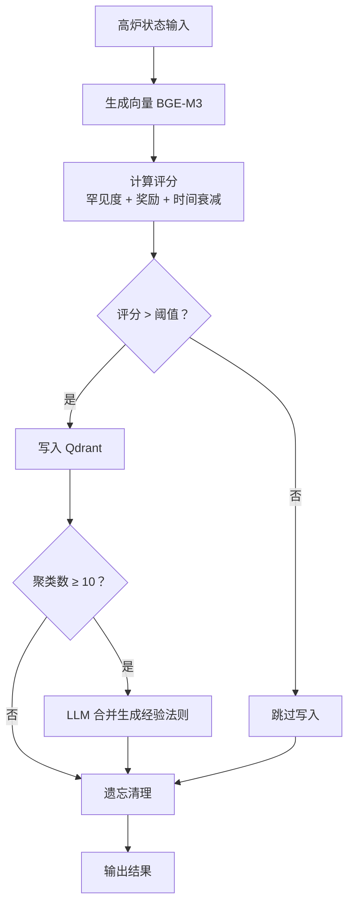

# LLM-RL 记忆系统

基于 **LangGraph + Qdrant + LLM** 的强化学习记忆管理系统，实现高炉出铁场景的试错学习、经验沉淀与遗忘优化。

> 🦾 项目代号：`llm_rl` | 版本：1.0 | 场景：工业高炉控制优化

---

## 📋 目录

- [功能特性](#-功能特性)
- [系统架构](#-系统架构)
- [快速开始](#-快速开始)
- [配置说明](#-配置说明)
- [使用示例](#-使用示例)
- [API 文档](#-api-文档)
- [代码结构](#-代码结构)
- [核心算法](#-核心算法)
- [扩展建议](#-扩展建议)
- [故障排查](#-故障排查)

---

## ✨ 功能特性

### 核心能力

| 功能 | 说明 |
|------|------|
| **智能记忆写入** | 基于重要性评分自动决策是否写入长期记忆 |
| **向量相似度检索** | 使用 BGE-M3 模型计算状态文本的罕见度 |
| **经验法则提炼** | 当聚类记录达到阈值时，LLM 自动合并生成通用经验 |
| **时间衰减遗忘** | 定期清理低评分记录，保持记忆库精炼 |
| **状态持久化** | LangGraph MemoryState 统一管理所有流转数据 |
| **异步执行支持** | 支持 `ainvoke` 高并发批量处理 |

### 技术栈

- **流程编排**: LangGraph (状态机图结构)
- **向量数据库**: Qdrant (相似度检索 + 存储)
- **嵌入模型**: BGE-M3 (1024 维归一化向量)
- **LLM**: Qwen3 (32B，本地部署)
- **API 服务**: FastAPI + Uvicorn

---

## 🏗️ 系统架构

### 数据流图



### 组件依赖

```
┌─────────────────────────────────────────────────────────────┐
│                     LLM-RL 记忆系统                          │
├─────────────────────────────────────────────────────────────┤
│  ┌──────────────┐    ┌──────────────┐    ┌──────────────┐  │
│  │  Qdrant      │    │  BGE-M3 API  │    │  Qwen LLM    │  │
│  │  :6333       │    │  :8001       │    │  :30620      │  │
│  └──────┬───────┘    └──────┬───────┘    └──────┬───────┘  │
│         │                   │                   │          │
│         └───────────────────┼───────────────────┘          │
│                             │                              │
│                    ┌────────▼────────┐                     │
│                    │  LangGraph      │                     │
│                    │  (状态机编排)    │                     │
│                    └─────────────────┘                     │
└─────────────────────────────────────────────────────────────┘
```

---

## 🚀 快速开始

### 前置要求

| 组件 | 版本 | 说明 |
|------|------|------|
| Python | 3.10+ | 推荐 3.11 |
| Qdrant | 1.7+ | 向量数据库 |
| CUDA | 11.8+ | GPU 加速（可选） |
| Ollama/Qwen | - | 本地 LLM 服务 |

### 1. 安装依赖

```bash
pip install -r requirements.txt
```

### 2. 启动依赖服务

#### 启动 BGE-M3 向量服务

```bash
python bge_m3_api_server.py
# 服务运行在 http://localhost:8001
# 健康检查：curl http://localhost:8001/health
```

#### 启动 Qdrant（Docker 方式）

```bash
docker run -p 6333:6333 qdrant/qdrant
```

#### 启动 Qwen LLM（Ollama 方式）

```bash
ollama run qwen3:32b
# 或使用其他兼容 OpenAI API 的本地部署
```

### 3. 运行测试

```bash
python Qdrant_LangGraph.py
```

输出示例：
```
[图构建] LangGraph 编译完成
========== 开始执行 LangGraph ==========
[节点 - 初始化] 所有客户端初始化完成
[节点 - 生成向量] 状态文本向量生成完成（维度：1024）
[节点 - 计算评分] 罕见度：0.85 | 重要性评分：2.34 | 聚类 ID：cluster_1741234567
[节点 - 写入判断] 评分 2.34 > 阈值 2.0，执行写入
[节点 - 写入 Qdrant] 成功写入记录（ID：1741234567890）
[节点 - 合并检查] 聚类 cluster_1741234567 有 1 条记录，无需合并
[节点 - 遗忘清理] 共删除 0 条低评分记录
```

---

## ⚙️ 配置说明

### 核心参数（`Qdrant_LangGraph.py`）

```python
# 评分权重
W1 = 0.6   # 奖励权重
W2 = 0.3   # 罕见度权重
W3 = 0.1   # 时间衰减权重

# 阈值配置
WRITE_THRESHOLD = 2.0        # 写入阈值
EVICTION_THRESHOLD = 0.5     # 遗忘阈值
CONSOLIDATE_THRESHOLD = 10   # 合并触发记录数

# BGE-M3 向量服务
BGE_API_BASE_URL = "http://localhost:8001"

# Qwen LLM 配置
QWEN_MODEL = "qwen3:32b"
QWEN_BASE_URL = "http://10.10.10.12:30620/v1"
QWEN_API_KEY = "-"
QWEN_TEMPERATURE = 0.7
```

### 重要性评分公式

```python
score = W1 * abs(reward) + W2 * rarity - W3 * delta_t

# 其中:
# - reward: 奖励值（绝对值）
# - rarity: 罕见度 (1 - 平均相似度)
# - delta_t: 时间衰减（天为单位）
```

---

## 📖 使用示例

### 基础用法

```python
from Qdrant_LangGraph import build_memory_graph, MemoryState

# 1. 构建图
memory_graph = build_memory_graph()

# 2. 准备输入
test_input = MemoryState(
    state_text="高炉出铁温度 1450℃，出铁量 45 吨，风口风速 18m/s",
    action="调整风口风速至 15m/s",
    reward=8.5  # 正向奖励
)

# 3. 执行
result = memory_graph.invoke(test_input)

# 4. 获取结果
print(f"写入成功：{result.write_success}")
print(f"触发合并：{result.consolidate_triggered}")
print(f"遗忘记录数：{result.evict_count}")
print(f"重要性评分：{result.importance_score:.2f}")
```

### 批量处理

```python
def batch_process(graph, input_list):
    """批量处理多条记录"""
    results = []
    for inp in input_list:
        res = graph.invoke(inp)
        results.append(res)
    return results

# 示例
inputs = [
    MemoryState(state_text=f"工况{i}", action="动作 A", reward=i*0.5)
    for i in range(10)
]
results = batch_process(memory_graph, inputs)
```

### 异步执行

```python
import asyncio

async def run_async():
    result = await memory_graph.ainvoke(test_input)
    return result

asyncio.run(run_async())
```

---

## 🔌 API 文档

### BGE-M3 向量服务 (`bge_m3_api_server.py`)

#### `POST /embed`

生成文本向量

**请求体**:
```json
{
  "texts": ["文本 1", "文本 2"],
  "prompt": "passage",
  "normalize": true
}
```

**响应**:
```json
{
  "embeddings": [[0.1, 0.2, ...], [0.3, 0.4, ...]],
  "dimension": 1024,
  "count": 2
}
```

#### `GET /health`

健康检查

**响应**:
```json
{
  "status": "ok",
  "model": "BAAI/bge-m3",
  "device": "cuda",
  "dimension": 1024
}
```

---

## 📁 代码结构

```
llm_rl/
├── Qdrant_LangGraph.py      # 主逻辑：LangGraph 状态机实现
├── bge_m3_api_server.py     # BGE-M3 向量生成服务
├── requirements.txt          # Python 依赖
├── README.md                 # 本文档
└── Qdrant_LangGraph.md       # 设计文档（旧版）
```

### 核心节点说明

| 节点名 | 功能 | 输入 | 输出 |
|--------|------|------|------|
| `init_clients` | 初始化 Qdrant/LLM 客户端 | - | qdrant_client, llm_client |
| `generate_embedding` | 生成状态文本向量 | state_text | state_embedding |
| `calculate_score` | 计算罕见度 + 重要性评分 | embedding, qdrant | rarity, importance_score, cluster_id |
| `write_decision` | 判断是否写入（条件分支） | importance_score | "write" / "skip_write" |
| `write_to_qdrant` | 写入长期记忆 | state, embedding | write_success |
| `consolidate_check` | 检查是否触发合并 | cluster_id | "consolidate" / "skip" |
| `consolidate_records` | LLM 合并生成经验法则 | 聚类记录 | consolidate_triggered |
| `evict_records` | 清理低评分记录 | - | evict_count |

---

## 🧠 核心算法

### 1. 罕见度计算

```python
# 1. 检索 Top-K 相似记录
search_results = qdrant.query_points(query=embedding, limit=100)

# 2. 计算平均余弦相似度
similarities = cosine_similarity([embedding], existing_embeddings)[0]
avg_similarity = np.mean(similarities)

# 3. 罕见度 = 1 - 平均相似度
rarity = 1 - avg_similarity
```

### 2. 经验法则合并

当同一聚类的记录数 ≥ 10 时触发：

1. 提取该聚类所有原始记录（state_text, action, reward）
2. 构造 LLM 提示词，要求总结为"状态 - 动作 - 奖励"格式
3. 调用 Qwen 生成经验法则文本
4. 生成经验法则的向量并写入 Qdrant
5. 删除原聚类中的所有旧记录（仅保留新经验法则）

### 3. 时间衰减遗忘

```python
# 重新计算每条记录的当前评分
current_score = W1 * abs(reward) + W2 * rarity - W3 * delta_t

# delta_t = (当前时间 - 记录时间) / 86400 (天)
# 删除评分 < EVICTION_THRESHOLD 的记录
```

---

## 🔧 扩展建议

### 1. 增加监控指标

```python
# 在 MemoryState 中添加
metrics: dict = {
    "total_records": 0,
    "total_rules": 0,
    "avg_importance_score": 0.0
}
```

### 2. 支持多集群隔离

为不同高炉/产线创建独立 Collection：

```python
collection_name = f"blast_furnace_memory_{furnace_id}"
```

### 3. 增加检索接口

```python
def retrieve_memories(query_text: str, top_k: int = 5):
    """检索最相关的记忆"""
    embedding = _bge_embed([query_text])[0]
    results = qdrant.query_points(query=embedding, limit=top_k)
    return results
```

### 4. 可视化调试

使用 LangGraph 内置工具：

```python
from langgraph.graph import draw_graph
draw_graph(memory_graph).show()
```

---

## 🐛 故障排查

### 问题 1: BGE 服务连接失败

```bash
# 检查服务是否运行
curl http://localhost:8001/health

# 查看日志
python bge_m3_api_server.py 2>&1 | tee bge.log
```

### 问题 2: Qdrant 集合创建失败

```bash
# 检查 Qdrant 是否运行
curl http://localhost:6333/collections

# 手动删除旧集合（如需重置）
curl -X DELETE http://localhost:6333/collections/blast_furnace_memory
```

### 问题 3: LLM 响应超时

- 检查 Qwen 服务是否可访问
- 增加 `timeout` 参数
- 减小 `max_tokens` 或降低并发

### 问题 4: 评分始终低于阈值

- 调整 `W1`, `W2`, `W3` 权重
- 降低 `WRITE_THRESHOLD`
- 检查 reward 值范围是否合理

---

## 📝 更新日志

- **v1.0** (2026-03-03): 初始版本
  - LangGraph 状态机实现
  - BGE-M3 向量服务集成
  - Qdrant 记忆存储
  - 经验法则自动合并
  - 时间衰减遗忘机制

---

## 🤝 贡献指南

欢迎提交 Issue 和 Pull Request！

### 开发环境设置

```bash
# 克隆仓库
git clone https://app.bmetech.com/ai-model/eco_tom/llm_rl.git

# 创建虚拟环境
python -m venv venv
source venv/bin/activate

# 安装依赖（含开发工具）
pip install -r requirements.txt
pip install pytest black flake8

# 运行测试
pytest tests/
```

---

## 📄 许可证

内部项目，仅供授权使用。

---

## 📞 联系方式

- **项目地址**: `https://app.bmetech.com/ai-model/eco_tom/llm_rl`
- **维护团队**: AI Model Team - Eco Tom

---

<div align="center">

**🦾 让机器在试错中持续进化**

</div>
